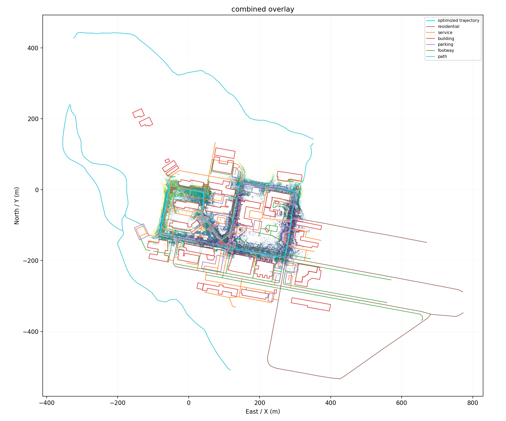

# GNU Campus Go-Kart Simulator

[English](README.md) | [한국어](README.ko.md)

An NVIDIA Isaac Sim and ROS 2 Humble simulation of the KAR go-kart on the
Gyeongsang National University Gajwa Campus. The environment combines measured
trajectory/LiDAR evidence with OSM roads and buildings, while the existing
vehicle, sensor, and MOZA R5 control stack remains intact.


Measured trajectory, LiDAR map evidence, and OSM features used to build the
campus environment:



## Highlights

- Full driven-area GNU campus environment with terrain, roads, sidewalks, and buildings
- PhysX road/terrain/building collision and a terrain-following spawn pose
- KAR go-kart with RGB/depth cameras, 3D LiDAR, GNSS, IMU, and odometry
- ROS 2 inputs for RoboRacer (`AckermannDriveStamped`) and Autoware (`Control`)
- MOZA R5 manual/shared-control pipeline
- Configurable ROS 2 physical-speed governor, set to **60 km/h** for GNU campus
- Opt-in stationary brake that reduces gravity roll on the sloped spawn road
- Viewport HUD showing commanded and measured vehicle state

## System requirements

| Component | Requirement |
|---|---|
| OS | Ubuntu 22.04 or newer with X11 |
| GPU | NVIDIA RTX GPU; RTX 4070 or newer recommended |
| Driver | NVIDIA 580 or newer |
| Container | Docker 24+ and NVIDIA Container Toolkit with CDI |
| Git | Git LFS 3+ |
| Storage | At least 45 GB for the Isaac Sim image and project assets |
| ROS | ROS 2 Humble is installed in the image |

The repository uses Git LFS for large GNU campus USD components.

## Quick start

```bash
git lfs install
git clone https://github.com/JunYoung270/gnu-campus-gokart-isaacsim.git
cd roboracer_isaacsim
git lfs pull
./docker/build.sh
```

Start the container and keep it open:

```bash
./docker/run.sh
```

Inside the container, launch the GNU campus simulation:

```bash
unset ROS_DISTRO
source /root/isaacsim/_build/linux-x86_64/release/setup_ros_env.sh
/root/isaacsim/_build/linux-x86_64/release/python.sh \
  scripts/launch_gnu_campus.py
```

First launch may take several minutes while shaders compile. The GUI stays open
until the user closes Isaac Sim or stops the container.

## Controls

The vehicle starts in `ROS2_CONTROL` mode.

| Input | Action |
|---|---|
| Hold `1` | Toggle Ego vehicle between ROS 2 and keyboard control |
| `W` / `Up` | Accelerate in keyboard mode |
| `S` / `Down` | Reverse/decelerate in keyboard mode |
| `A`, `D` / arrow keys | Steer |
| `Space` | Stop keyboard command |
| `Backspace` | Restart simulation |
| `/` | Toggle HUD |
| `` ` `` | Perspective camera |

## ROS 2 interface

| Topic | Type | Purpose |
|---|---|---|
| `/ego/drive` | `ackermann_msgs/msg/AckermannDriveStamped` | RoboRacer target speed and steering |
| `/ego/control` | `autoware_control_msgs/msg/Control` | Autoware target speed and steering |
| `/ego/odom` | `nav_msgs/msg/Odometry` | Physical vehicle motion |
| `/ego/imu` | `sensor_msgs/msg/Imu` | IMU data |
| `/ego/point_cloud` | `sensor_msgs/msg/PointCloud2` | 3D LiDAR |
| `/ego/gnss` | `sensor_msgs/msg/NavSatFix` | GNSS fix |
| `/ego/camera/*` | ROS image and camera-info messages | Stereo/depth cameras |

Example low-speed command:

```bash
source /opt/ros/humble/setup.bash
export RMW_IMPLEMENTATION=rmw_fastrtps_cpp
export ROS_DOMAIN_ID=0
ros2 topic pub --rate 10 /ego/drive \
  ackermann_msgs/msg/AckermannDriveStamped \
  '{drive: {speed: 0.5, steering_angle: 0.0}}'
```

The GNU campus configuration clamps target-speed commands from both ROS input
topics to `16.6666666667 m/s` (60 km/h), including reverse commands by magnitude.
Non-finite commands are rejected. This target-speed limit does not turn a raw
throttle actuator command into closed-loop speed control.

## MOZA R5

For wheel control, launch Isaac Sim with the direct-actuator vehicle/config:

```bash
/root/isaacsim/_build/linux-x86_64/release/python.sh \
  scripts/launch_gnu_campus.py \
  --config scripts/configs/gnu_campus_kar_actuator.yaml
```

Build the workspace inside the container:

```bash
cd /workspace/autoware_off-road_sim/ros2_ws
source /opt/ros/humble/setup.bash
colcon build --symlink-install \
  --packages-select moza_gokart_interfaces moza_gokart_control
source install/setup.bash
ros2 launch moza_gokart_control manual_drive.launch.py \
  config:=/workspace/autoware_off-road_sim/ros2_ws/src/moza_gokart_control/config/moza_r5_actuator.yaml
```

The HUD shows each normalized pedal input first and the safety-adjusted PhysX
output in parentheses. The GNU actuator profile starts with throttle scaled to
15% for low-speed validation, applies brake on command timeout, applies a full
brake near standstill, and cuts throttle at the 60 km/h physical-speed boundary.
Increase the throttle scale only after pedal polarity and braking have been
verified at low speed.

See the [MOZA control guide](ros2_ws/src/moza_gokart_control/README.md) for
target-speed mode, direct actuator mode, fail-safe behavior, and telemetry logs.

## Configuration

The target-speed config is
[`scripts/configs/gnu_campus_kar_physx.yaml`](scripts/configs/gnu_campus_kar_physx.yaml),
and the MOZA direct-actuator config is
[`scripts/configs/gnu_campus_kar_actuator.yaml`](scripts/configs/gnu_campus_kar_actuator.yaml).

```yaml
network_setup:
  ros2_domain_id: 0
  rmw_implementation: rmw_fastrtps_cpp
  ros2_max_speed_m_s: 16.6666666667  # 60 km/h
control_settings:
  ros2_command_mode: speed
  stationary_hold_brake: 1.0
```

`ros2_max_speed_m_s` is optional for other environments. When present, it must
be finite and positive.

## Repository layout

```text
assets/maps/gnu_campus_stage_D_full_usd/  Runtime campus map and validation
assets/vehicles/                           Go-kart and RoboRacer USD assets
scripts/launch_gnu_campus.py              GNU campus entry point
scripts/launch_sim.py                     Simulator, HUD, sensors, and bridges
scripts/configs/                           Environment/vehicle configurations
ros2_ws/src/moza_gokart_control/          MOZA/shared-control nodes
ros2_ws/src/moza_gokart_interfaces/       Direct actuator message
docker/                                   Reproducible Isaac Sim 6 image
```

Raw point clouds and Stage B/C map-generation intermediates are intentionally
excluded from Git. Only runtime Stage D assets and compact validation evidence
belong in the shared simulator repository.

## Known limitations

- Very small lateral creep can remain after stopping on a cross-slope. The
  wheel-brake hold is deliberately retained because forcing the rigid-body
  velocity from the USD update loop was unstable in Isaac Sim.
- The MOZA actuator profile is currently limited to 15% throttle for safe
  validation. Hill starts can therefore roll backward briefly; retune the
  throttle scale and vehicle dynamics before high-speed testing.
- Full-route and physical 60 km/h validation are still pending.

## Validation status

- Visual map/vehicle/HUD gate: passed by interactive GUI inspection
- Static vehicle contact: passed at the configured spawn pose
- ROS 2 bridge and required topics: passed
- 0.5 m/s command and stop: passed using measured simulator state
- 60 km/h command-clamp unit tests: passed
- MOZA steering, throttle, brake, HUD, and ROS 2 actuator bridge: passed by
  interactive GUI inspection
- Full 60 km/h vehicle-dynamics and route test: pending

## License and data attribution

Code is licensed under [Apache License 2.0](LICENSE). Map features derived from
OpenStreetMap require attribution to [OpenStreetMap contributors](https://www.openstreetmap.org/copyright).
Confirm that all measured campus data and third-party assets may be redistributed
before publishing a public release.
